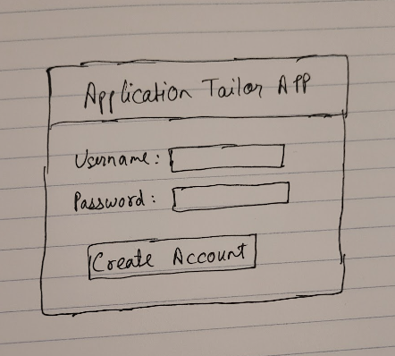
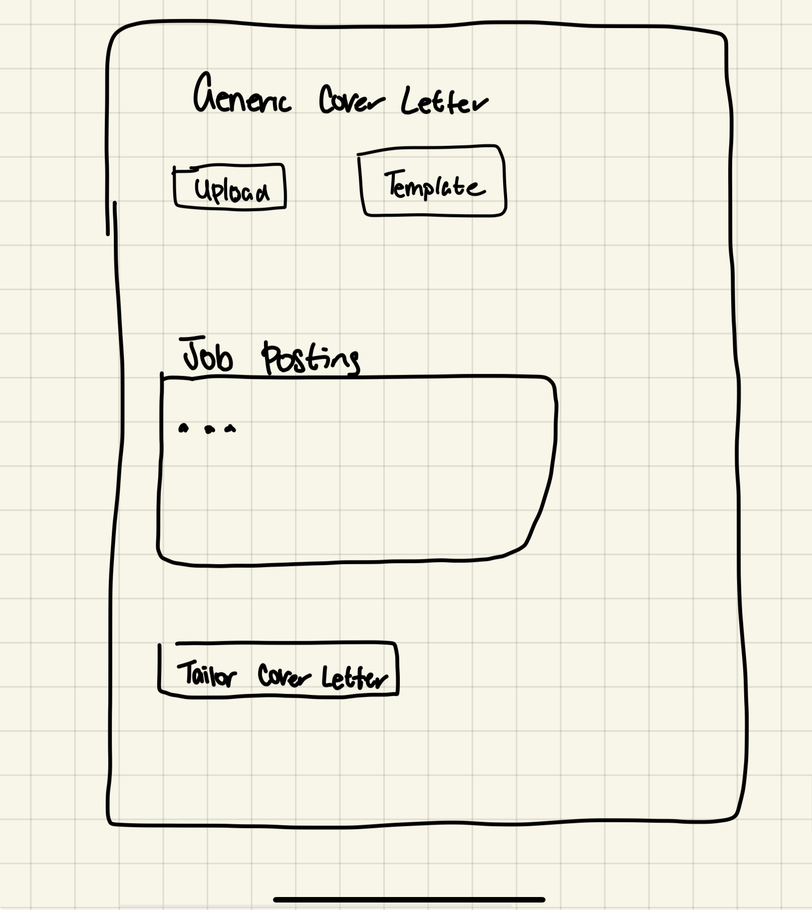
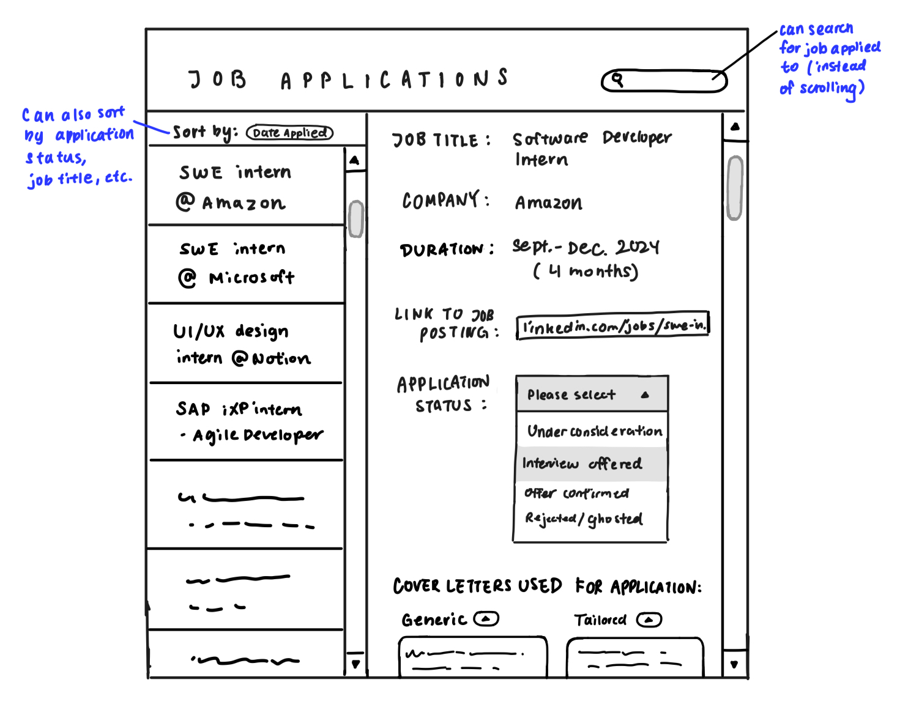

# Team SVKK (Group 28) - Project Title: Application Tailor

## Describe your topic/interest in about 150-200 words
The goal of this application is to help match students to their internships based on their current qualifications, minimizing the time consumed in the application process, resulting in an increased success rate during the co-op job search term. This application aims to achieve this by automating the 15-30 mins spent on tailoring a Resume and/or Cover Letter for every job posting. In an economy that requires at least 30 applications sent each week during classes, this often comes at the expense of student’s grades and more importantly their mental health, affecting their long term prospects. This application aims to mitigate these unnecessary drawbacks while maintaining the quality and authenticity of each job application.

## Progress 1 
**Project Description: Write 3-5 sentences on your project topic. (try to address all points below)**
- Who is it for?
    - Students seeking internships during their busy term (applicants)
- What will it do? (What “human activity” will it support?)
    - Allow students to reach more opportunities in their limited job search time, and mitigate its mental and academic drawbacks.
- What type of data will it store?
    - Username
    - Password
    - Email
    - CV
    - Resume
    - Generic Cover Letter
    - Jobs applied so far and associated metrics (success rate, response time)
- What will users be able to do with this data?
    1. Accounts: 
        - Create, edit, remove an account.
        - Add, remove CV, Resume, Cover Letter
    2. Core Application Functionality:
        - Generate a Cover Letter given a job posting and (Resume or CV).  The job posting will be:
            - Job posting (Copy paste text initially)
            - Job posting (Screenshot/URL if time allows)
        - Generate a Resume given a CV and job posting
- What is some additional functionality you can add/remove based on time constraints?
    - Remove the Web scraper portion for URL Job postings. 
    - Remove the Resume generation requirement.
    - Add Web scraper functionality to find internship opportunities from UBC CareersOnline, or use other APIs that don’t require logins.
 
**Project task requirements:**
- 3-5 minimal requirements (will definitely complete)
  1. Users can Create accounts
  2. Users can Edit accounts
  3. Users can Remove accounts
  4. Users can add a Resume to their account
  5. Users can add a Cover Letter to their account.
     
- 3-7 “standard” requirements (will most likely complete)
  1. Users can add job descriptions 
  2. Users can choose from a generic cover letter template and fill it with their professional experience/past projects (can be used by students who have not made a cover letter)
  3. Users can generate tailored cover letters given a job posting and a filled-in generic cover letter
  4. Users can save job application information on their account organized into 5 categories:
      - Viewing/Considering
      - Sent (Allows the user to keep track of their sent applications)
      - No Response:
      - Responded: 
          - Successful applications
          - Unsuccessful Applications
  5. Users can see and compare the **success rate** (Successful responses / sent applications) for each **individual** generic cover letter
  6. Users can see and compare the **response time for an interview offer** (Averaged elapsed response time for all applications using that document) for each **individual** generic cover letter
     
- 2-3 stretch requirements (plan to complete at least 1!)
  1. Users can specify the font and font-size of the tailored cover letter
  2. Users can generate a **Resume** given a Job Posting, and select which CV they want to base their Resume on.	
      - Resume = Job Posting + CV	
  3. Add web scraper portions to enable URLs to job postings to be used instead of copy-pasting text for more convenience. 
  4. Add suggestions to improve the resume/cover letter based on certain criteria. 
  5. Users can see the **summary** on a webpage (html file similar to assignment 1), using analytics
     
**Pick 2 of your minimal requirements and break each of them down into ~2-5 smaller tasks!
This will help you divide up work among your teammates.**

  **Users can Create accounts**
    - Users will be asked to register/create an account using a username and password for each account created in a database using an html/react-form
    - The password will be encrypted (probably using a node.js package called bcrypt.js)
    - The user data will be stored in a Mogodb database
      
  **Users can add a cover letter**
    - Users will copy and paste the text from the cover letter they want to add to their account into a text area 
    - The cover letter content will be stored in a database which can be retrieved in future when the user logs in into the account
    - ~~The user can click a button that stores the content of the cover letter in a mongodb database corresponding to the user's account for data persistence. The user will be able to use this cover letter anytime they log in as it is saved in their account~~

<b> Finally, draw 2-3 rough sketch prototypes of some key tasks of your app. Sketch these physically on paper and then scan and add to your repo. (If you’d like to use sketch/prototype software because that’s easier somehow, you can, but we’d advise against it as these prototypes should be low-fidelity (i.e. look bad)). </b>

    
  
  
  ## Team Members

- Silvana
- Vishal
- Kurtis
- Kevin

## Images

{You should use this area to add a screenshot of your app or website }

## References

{Add your stuff here}

